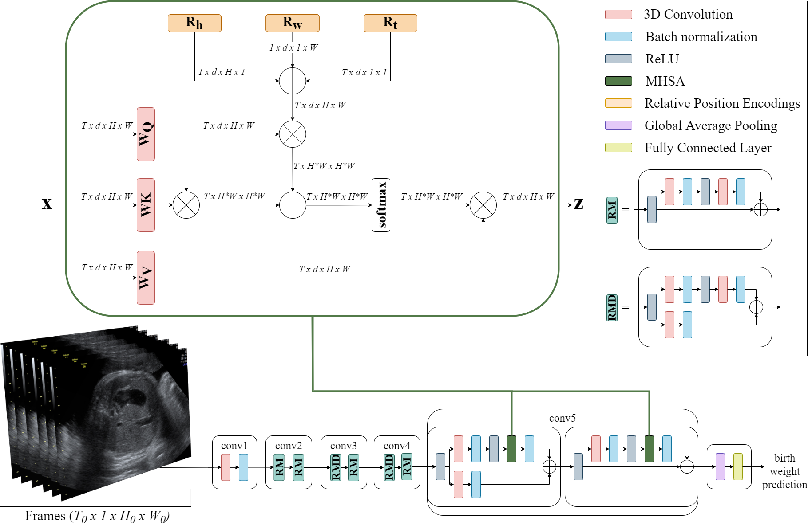

# BabyNet: Residual Transformer Module for Birth Weight Prediction on Fetal Ultrasound Video

This is the official released code for "BabyNet: Residual Transformer Module for Birth Weight Prediction on Fetal
Ultrasound Video" early accepted for the 25th International Conference on Medical Image Computing and 
Computer Assisted Intervention (MICCAI) 2022 in Singapore.



### Abstract

Predicting fetal weight at birth is an important aspect of perinatal care, particularly in the context of antenatal
management, which includes the planned timing and mode of delivery. Accurate prediction of weight using prenatal
ultrasound is challenging as it requires images of specific fetal body parts during advanced pregnancy - this, however,
is complicated by the poor quality of images caused by the lack of amniotic fluid. It follows that predictions which
rely standard methods often suffer from significant errors. In this paper we propose the Residual Transformer Module,
that extends a 3D ResNet-based network for analysis of 2D+t spatio-temporal ultrasound video scans. Our end-to-end
method, called BabyNet, fully automatically predicts fetal birth weight based on fetal ultrasound video scans. We
evaluate BabyNet using a dedicated clinical set comprising 225 2D fetal ultrasound videos of pregnancies from 75
patients performed one day prior to delivery. Experimental results show that BabyNet outperforms several
state-of-the-art methods and estimate the weight at birth with accuracy comparable to human experts. Furthermore,
combining estimates provided by human experts with those computed by BabyNet yields the best results, outperforming
either method by a significant margin.

### Usage

#### Train the model

> python3 train_video.py 
>
If you are using our codes, please cite our work:
```
@article{plotka2022babynet,
  title={BabyNet: Residual Transformer Module for Birth Weight Prediction on Fetal Ultrasound Video},
  author={P{\l}otka, Szymon and Grzeszczyk, Micha{\l} K and Brawura-Biskupski-Samaha, Robert and Gutaj, Pawe{\l} and Lipa, Micha{\l} and Trzci{\'n}ski, Tomasz and Sitek, Arkadiusz},
  journal={arXiv preprint arXiv:2205.09382},
  year={2022}
}
```